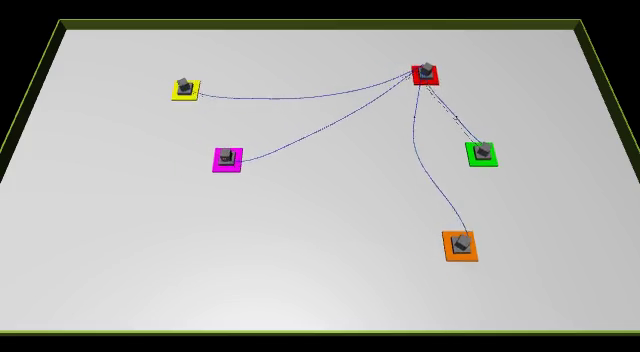

# WireHarness-MultiAgent-RL

A [Gymnasium](https://gymnasium.farama.org/)-compatible reinforcement learning environment for **multi-robot wire handling** in [MuJoCo](https://mujoco.org/).

A single policy controls five planar movers via a joint action space to navigate cable harnesses to target configurations on an assembly board without causing collisions.



---

## Installation

Requires a local clone — editable install only (`pip install git+...` does **not** work because the simulation source files live in the repo root).

```bash
git clone https://github.com/ludwigstr/WireHarness-MultiAgent-RL.git
cd WireHarness-MultiAgent-RL
pip install -e .
```

Dependencies: `gymnasium >= 0.29`, `mujoco >= 3.0`, `numpy`, `imageio[ffmpeg]`

---

## Quick Start

```python
import gymnasium as gym
import wireharness_gym          # registers the environment IDs

# Fixed target configuration (config 0):
env = gym.make("WireHarnessRouting-v0")

# Random target sampled each episode:
env = gym.make("WireHarnessRouting-v1")

obs, info = env.reset()
obs, reward, terminated, truncated, info = env.step(env.action_space.sample())
env.close()
```

---

## Environment Details

### Registered IDs

| ID | `target_config_idx` | Description |
|----|---------------------|-------------|
| `WireHarnessRouting-v0` | `0` (fixed) | Single target configuration |
| `WireHarnessRouting-v1` | `None` (random) | Random target sampled each episode |

Both variants use `max_episode_steps=750`.  
Use `WireHarnessEnv(target_config_idx=k)` directly for any specific config `k ∈ {0,…,4}`.

### Observation Space

`Box(-inf, inf, shape=(31,), dtype=float32)`

| Indices | Content |
|---------|---------|
| 0 – 19 | Pairwise signed (x, y) distances between all C(5,2)=10 mover pairs |
| 20 – 29 | Distance-to-target and angle-to-target for each of the 5 movers |
| 30 | Target configuration index (0–4) as float |

### Action Space

`Box(-1.0, 1.0, shape=(10,), dtype=float32)` — normalised (vx, vy) velocity command for each of the 5 movers.

### Reward

| Event | Reward |
|-------|--------|
| Per step | −1 (time penalty) |
| Mover collision | −0.1 × collision map sum |
| Cable-on-mover collision | −0.005 × collision map sum |
| All movers reached target | +25 |

### `info` Dictionary

```python
{
    "target_config_idx": int,        # active target layout (0–4)
    "target_positions": list,        # [[x,y], ...] per mover
    "mover_distances": list[float],  # current distance to target per mover
    "all_reached": bool,             # True if episode ended successfully
    "nan_detected": bool,            # True if physics exploded
}
```

---

## Target Configurations

Five layouts define target positions for all 5 movers:

| Index | Description |
|-------|-------------|
| 0 | Top-right cluster |
| 1 | Bottom-right cluster |
| 2 | Centre cluster |
| 3 | Left cluster |
| 4 | Taping stations (final assembly positions) |

---

## Headless Rendering

The environment defaults to EGL headless rendering (`MUJOCO_GL=egl`), suitable for servers without a display. To render frames:

```python
env = gym.make("WireHarnessRouting-v0", render_mode="rgb_array")
obs, info = env.reset()
frame = env.render()   # numpy array (H, W, 3)
```

---

## License

MIT
